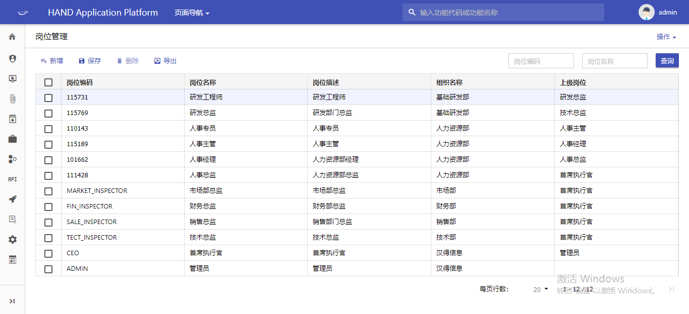
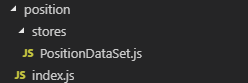
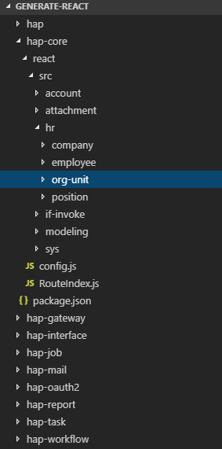

## 使用HAP-4.0开发一个功能的最佳实践

### 场景和功能

以HAP4.0中的`岗位管理`为例子，选这个为例子是因为这个功能比较简单，而且最佳实践更多的是一个入门教程。

实现功能如下：



### 功能分析和目录划分

这个页面只有一个表格页面，使用Table展示。

Table展示的数据是分页的，可操作的（增删查等），可搜索的。

所以，这个Table对应DataSet（DataSet相当于数据的仓库）。

建立如下的结构：



- 一般会把DataSet放到单独的目录stores下，每个DataSet建立一个文件
- 如果项目只有一个页面，可以直接在index.js中开发，如果有多个页面，可以在view文件下建立多个文件
- 熟悉React的同学肯定知道，其实这就是Component的概念，所以像弹窗（Modal）也可以作为一个view拆分出去
- 如果有自己的样式要求，可以在index.js同级建立index.scss的样式文件

### 代码开发

1. 确定DataSet，DataSet作为数据的仓库（仓库提供部分操作和方法），在开发中是最为重要的，当数据确定了，展示为什么样子只是选用组件的问题。

```js
export default {
  primaryKey: 'positionId',
  autoQuery: true,
  pageSize: 20,
  name: 'Position',
  fields: [
    { name: 'positionCode', type: 'string', label: '岗位编码', required: true, unique: true },
    { name: 'name', type: 'intl', label: '岗位名称', required: true },
    { name: 'description', type: 'intl', label: '岗位描述' },
    { name: 'hrorgunit', type: 'object', textField: 'name', label: '组织名称', lovCode: 'LOV_UNIT', required: true },
    { name: 'unitId', bind: 'hrorgunit.unitId', type: 'number' },
    { name: 'unitName', require: true, bind: 'hrorgunit.name', type: 'string' },
    { name: 'position', type: 'object', textField: 'name', label: '上级岗位', lovCode: 'LOV_POSITION' },
    { name: 'parentPositionId', bind: 'position.positionId', type: 'number' },
    { name: 'parentPositionName', bind: 'position.name', type: 'string', require: true },
  ],
  queryFields: [
    { name: 'positionCode', type: 'string', label: '岗位编码' },
    { name: 'name', type: 'string', label: '岗位名称' },
  ],
};

```

其中name就是用来定义后端查询的名字，autoQuery是指当DataSet实例化后立即查询，fields是指可能用到的字段，queryFields是指用于查询的字段，也就是效果图中右上角的部分。

2. 当确定好后DataSet，我们会发现，这个DataSet导出的只是一个对象（js中的普通对象）。我们要把他实例化后，他才是一个真正的DataSet。

关键代码如下：

```js
import React, { PureComponent } from 'react';
import { DataSet, Table } from 'choerodon-ui/pro';
import { Content } from 'choerodon-hap-front-boot';
import PositionDataSet from './stores/PositionDataSet';

const { Column } = Table;

export default class Index extends PureComponent {
  positionDS = new DataSet(PositionDataSet);

  render() {
    return (
      <Content>
        <Table
          buttons={['add', 'save', 'delete', 'export']}
          dataSet={this.positionDS}
          queryFieldsLimit={2}
        >
          <Column name="positionCode" editor sortable />
          <Column name="name" editor sortable />
          <Column name="description" editor />
          <Column name="hrorgunit" editor sortable />
          <Column name="position" editor sortable />
        </Table>
      </Content>
    );
  }
}

```
不难发现，最主要的就是选择组件（这里是Table），绑定dataSet（注意是实例化后的dataSet），然后就是一些表现的特质化（比如编辑时的逻辑等）。

### 总结

总的来说，开发一个页面分为如下几步

1. 确定DataSet的结构（注意这里是一个普通的对象）
2. 开发页面，在生命周期内实例化（生命周期中实例化的好处是当页面销毁时，DataSet一起销毁了）
3. 选取表现的组件，绑定上实例化后的DataSet
4. 定制化一些行为和表现，如点击事件，弹窗和修改等

### 参考资料

- [choerodon-hap-ui官网]()
- [choerodon-hap-front-boot参考文档]()

### 更多例子

可以在自己的项目target目录下找到generate-react目录，其中每个目录为一个模块，进入其中的react目录后可以找到对应的源码。

